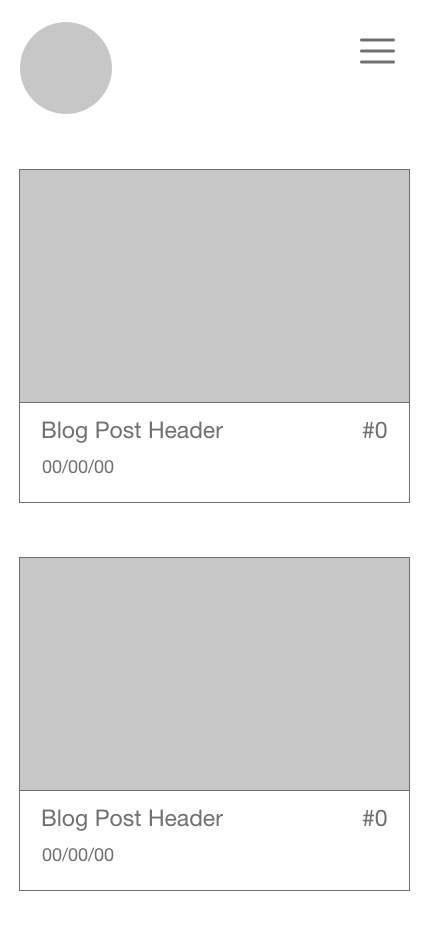
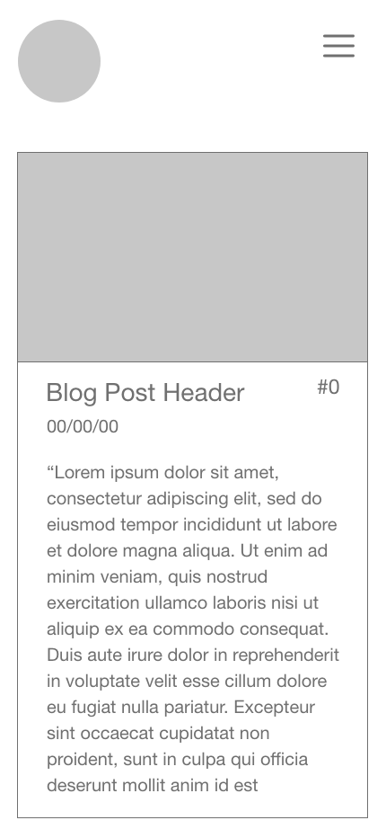
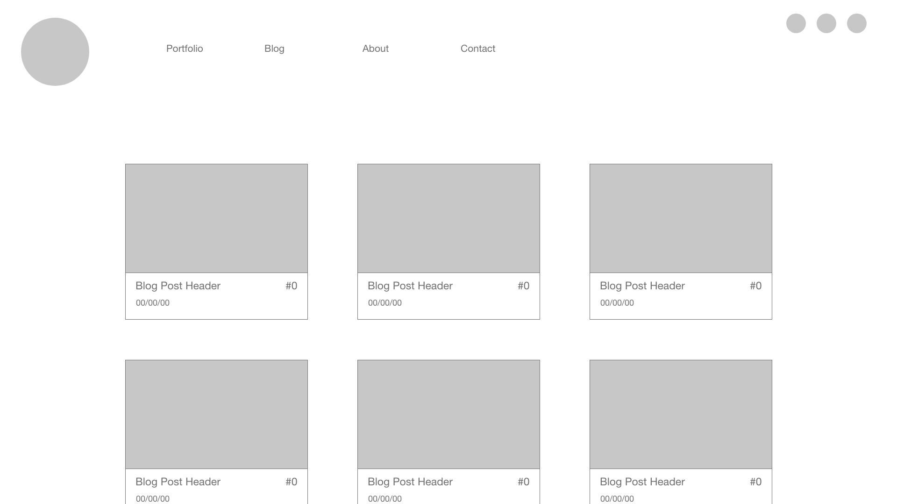
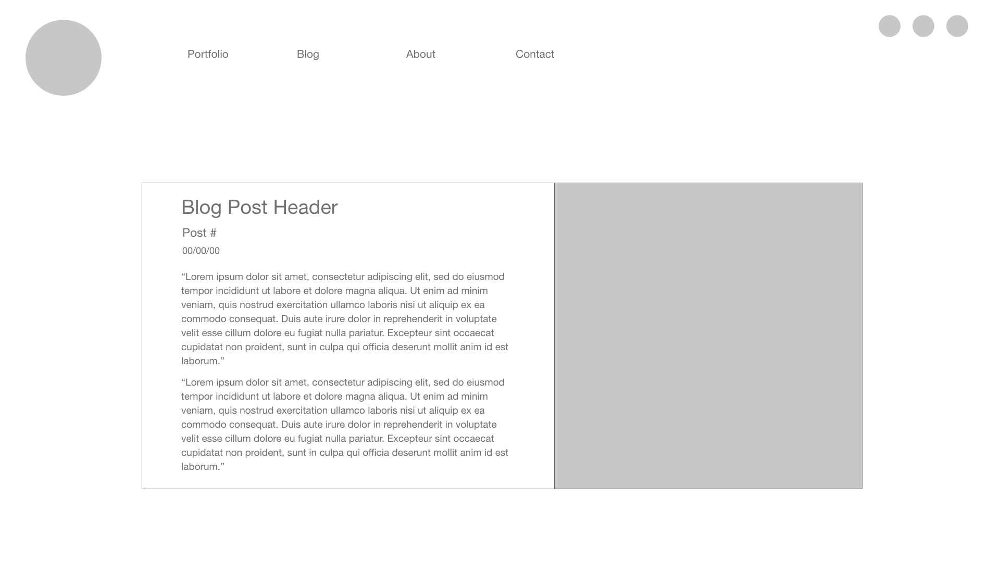

# Blog Teaser Mobile
- Simple/clean design
- Process images, black san serif type, ample white space
- Logo at top left
- Hamburger menu at top right
- User can scroll down a column of cards
- Cards show a teaser image from actual post
- Blog post title, date and post number displayed below image

  

# Blog Post Mobile
- Expands from teaser state
- Same design, with body copy expanding card frame

  

# Blog Teaser Web
- Expanded version of mobile template
- Nav bar (same links as mobile hamburger menu)
- Blog teaser cards span 3 wide, collapsing to 2, then 1

  

# Blog Post Web
- Card expands to fill width of main container
- Post title, date and body copy on the left
- Image on the right
- Teaser cards below post

  
